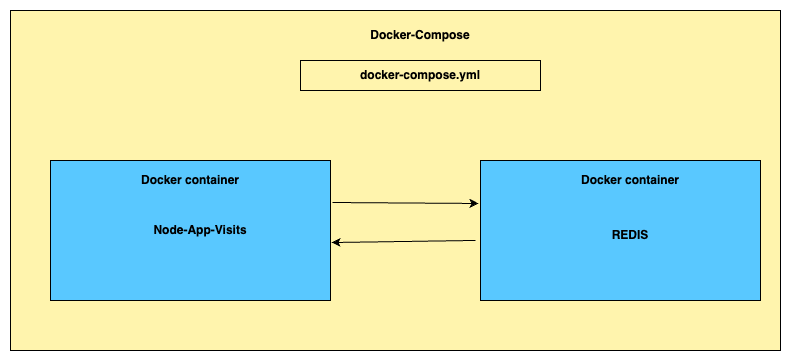

### Dockerfile

```dockerfile
  # base image for node v.18 ( from Docker Hub )
  FROM node:18-alpine

  # setup the working directory inside the image for our app files to be pasted in
  WORKDIR /app

  # firstly copy just package.json into . (which will be /app directory inside the image fs)
  COPY package.json .
  # it will install/re-install thae packeges only if package.json has changed
  RUN npm install
  #  then copy the rest of app files from root dir into /app dir inside the image fs
  COPY . .

  # run the command when the image is started up as a container
  CMD [ "npm", "start" ]
```

### Docker cli commands

- `docker ps` - view currently running docker containers
- `docker images` - view the previously build images list
- `docker build -t username/app-name .` - build the docker image from current directory and name it `username/app-name`
- `docker run <image name>` - run docker container using an image
- `docker run -p 3001:8081 username/app-name` - run application image `username/app-name` and map external request (browser) port `3001` to the container's port `8081`
- `docker logs <container ID>` - read the container running logs

#### To tun the cli or other command inside the running container:

- `docker exec -it <container ID> <command>`

Example:

- run `docker ps`
- `CONTAINER ID   IMAGE     COMMAND   CREATED   STATUS    PORTS     NAMES`
- `123asfghJ591`
- then run:
- `docker exec -it 123asfghJ591 sh` - which will run the linux cli inside the running container ID `123asfghJ591`

### Docker-compose

When we want to run multiple applications inside of a separate container for each,
we want for these apps to be able to communicate/connect between, to prevent these apps to be isolated within their separate containers;



`docker-compose.yml` - is a docker-compose settings file``

```yml
# verson of docker-compose we want to use
version: "3"

# Here is what we want to do (services, eg, containers to run)
services:
  redis-server:
    image: redis
  node-app-visits:
    # build image using Dockerfile, look into current direcory
    build: .
    ports:
      - "8081:8081"
```

Then when we create a node server, we shall use the `redis-server` service name from `docker-compose.yml` file
as a hostname for redis client connection

```js
const express = require("express");
const redis = require("redis");

const app = express();
const PORT = process.env.PORT || 8081;

app.use(express.json());
app.use(express.urlencoded({ extended: false }));
const client = redis.createClient({
  socket: {
    host: "redis-server", // as specified in the docker-compose.yml line:6
    port: 6379,
  },
});

client.on("connect", () => {
  console.log("Redis Client Connected!");
});
client.on("error", (err) => {
  console.log("Redis Client Error", err);
  client.quit();
});

client.connect();

client.set("visits", 0);

app.get("/", async (req, res, next) => {
  try {
    const visits = await client.get("visits");
    await client.set("visits", parseInt(visits, 10) + 1);
    res.status(200).json({ data: visits });
  } catch (error) {
    const msg = error instanceof Error ? error.message : error.toString();
    res.statusMessage = "Redis get key method failure";
    res.status(500).json({ error: msg });
  }
});

app.listen(PORT, () => {
  console.log(`Express server at http://localhost:${PORT}`);
});
```

### Docker-compose cli commands

- `docker-compose up --build` - build the images and run the containers ( specified in `docker-compose.yml`)
- `docker-compose up` - run the containers using previously built images ( specified in `docker-compose.yml`)
- `docker-compose up -d` - run the containers on the background
- `docker-compose down` - stop the containers
